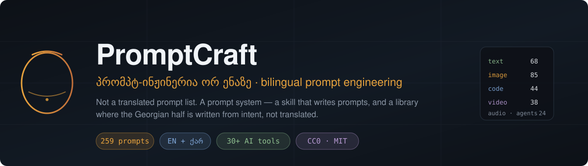
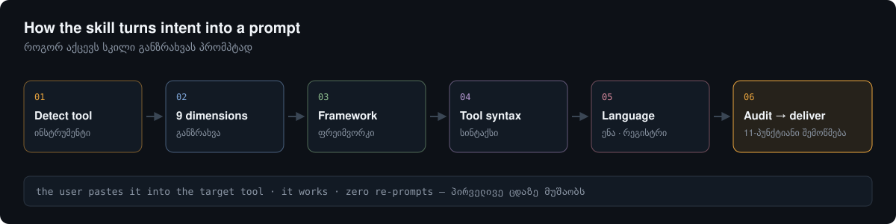
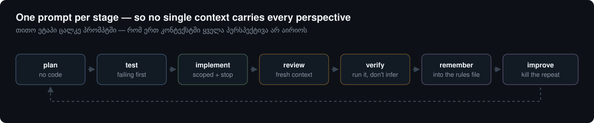

<div align="center">



# PromptCraft

**A bilingual (English · ქართული) prompt engineering skill and library.**

Not a translated prompt list. A prompt *system* — one skill that writes prompts for you,
plus a curated library where every prompt exists in English and in properly adapted Georgian.

[Skill](SKILL.md) · [Library](library/) · [Frameworks](references/frameworks.md) · [Anti-patterns](references/anti-patterns.md) · [Harness](references/agent-harness.md) · [ქართულად](README.ka.md)

</div>

---

## Why this exists

Two problems, one repo.

**Problem 1 — the re-prompt tax.** Vague prompt → wrong output → re-prompt → closer → re-prompt again.
Every loop burns credits, tokens and time. The fix is not "more prompts", it is a *method* for
turning intent into a prompt that works on the first try.

**Problem 2 — Georgian is a second-class prompt language.** Most Georgian-language AI content is
machine-translated from English. That produces prompts that are grammatically strange, use calqued
terminology nobody says out loud, and reference contexts (401k, DMV, Thanksgiving) that mean nothing here.
A Georgian prompt should read like it was *written* in Georgian, by someone who works in Georgia.

PromptCraft solves both: a skill that generates prompts (Problem 1) and a library where the Georgian
half is adapted, not translated (Problem 2).

## What's in here

| Part | What it is |
|---|---|
| [`SKILL.md`](SKILL.md) | The skill. Drop it into Claude, Claude Code, Cursor or any agent that reads skills. It detects your target tool, extracts intent across 9 dimensions, picks a framework, and returns one production-ready prompt. Bilingual: it will write the prompt in English or Georgian. |
| [`library/`](library/) | **240 curated prompts** across text, image, video, code, audio and agents. Every entry is EN + KA. |
| [`references/`](references/) | Frameworks, tool-specific syntax routing, anti-patterns, quality checklist, the agent harness layer, and the Georgian localisation style guide. |
| [`harness/`](harness/) | Drop-in standing-rules templates for `CLAUDE.md` / `AGENTS.md` / `.cursorrules`, EN and KA. The lines you should stop retyping into every prompt. |
| [`library/GALLERY.md`](library/GALLERY.md) | Every entry that has a sample image, in one contact sheet. |
| [`data/prompts.csv`](data/prompts.csv) | The whole library as machine-readable CSV (`id,category,title_en,title_ka,prompt_en,prompt_ka,tools,tags`). Import it anywhere. |

## Quick start

### Use the skill

**Claude / Claude Code**
```bash
git clone https://github.com/REPLACE_ME/promptcraft.git
cp -r promptcraft ~/.claude/skills/promptcraft
```
Then ask: *"Use promptcraft — I need a prompt for Midjourney for a Tbilisi wine bar brand shoot."*

**Anything else** — paste the contents of [`SKILL.md`](SKILL.md) as a system prompt.

### Use the library

Browse [`library/`](library/), copy a prompt, replace the `{{variables}}`. Each entry tells you which tools it targets.

```
library/
├── text/      writing · business · education · research · everyday
├── image/     midjourney · gpt-image · nano banana · flux & SD · brand & product · reverse prompting
├── video/     sora & veo · seedance · runway & kling · shot language
├── code/      agentic coding · workflow loop · debugging · review & architecture
├── audio/     voice & music
└── agents/    automation & multi-step agents
```

### Stop retyping your standing rules

Half of a good agentic prompt is facts that have not changed since Monday — your test command,
your commit convention, your "never install packages" rule. Those belong in the harness, not in
every prompt. Copy [`harness/rules.md`](harness/rules.md) into your `CLAUDE.md` / `AGENTS.md` /
`.cursorrules`, then delete those lines from your prompts.
Why and what goes where: [`references/agent-harness.md`](references/agent-harness.md).

## How the skill works



## The engineering loop



Prompts for every stage: [`library/code/workflow-loop.md`](library/code/workflow-loop.md).

## The rules that make a prompt work

Distilled from the highest-signal prompt repos on GitHub and from what actually survives contact with a model.

1. **Name the tool before you write the prompt.** A Midjourney prompt and a Claude prompt share no syntax. Comma-separated descriptors vs. XML-tagged instructions.
2. **Put the hard constraint in the first 30%.** Attention decays. `MUST NOT exceed 200 words` at the bottom of a long prompt gets ignored.
3. **Say what to do, not what to avoid.** "Write in short declarative sentences" beats "don't be verbose."
4. **Bound the scope.** For agents: starting state, target state, file scope, forbidden actions, and a stop condition. Runaway loops are the single biggest credit killer.
5. **Define done.** A binary success criterion, not a vibe. "Passes `pytest tests/auth`" not "make it good."
6. **One example beats three paragraphs of description.** Lock the format with an input/output pair.
7. **Don't ask for hidden reasoning.** "Show me your chain of thought" degrades output on reasoning models.
8. **Skip the fabrication-prone techniques.** Tree of Thought, Graph of Thought, Mixture of Experts — impressive names, unreliable in production, expensive in tokens.

Full treatment: [`references/anti-patterns.md`](references/anti-patterns.md).

## The Georgian half is not a translation

This is the part that took the most work, and the part most likely to be done badly elsewhere.

**Rules we follow** (full version: [`references/georgian-style-guide.md`](references/georgian-style-guide.md)):

- **Register.** Prompts address the model with `შენ`-form, imperative, no `თქვენ`-form politeness padding. `დაწერე`, not `გთხოვთ დაწეროთ`.
- **Terminology.** Established loanwords stay as loanwords. `პრომპტი`, `ბრენდი`, `კონტენტი`, `ტოკენი`, `დედლაინი` — because that is what people in the field actually say. We do not invent purist neologisms that read as a translation exercise.
- **Word order.** Georgian is verb-final-leaning and information-structure sensitive. English's "You are an expert X who does Y" becomes `შენ ხარ X, რომელიც Y` — not a word-by-word transposition that leaves the verb stranded.
- **No calqued idiom.** "Think step by step" is not `იფიქრე ნაბიჯ-ნაბიჯ` as a fossil; it becomes `დაშალე ამოცანა ეტაპებად` where the register calls for it.
- **Context is swapped, not kept.** A budgeting prompt says `ლარი`, not `dollars`. A hiring prompt references `hr.ge` and `jobs.ge`, not LinkedIn-only workflows. A tax prompt references `RS.ge` and `მცირე ბიზნესის სტატუსი`. A school prompt references `ეროვნული გამოცდები`, not the SAT.
- **Georgian grammar in output specs.** When a prompt asks the model to write Georgian, it says so explicitly and specifies register, because models drift into translationese otherwise. Most KA prompts carry a line like `დაწერე ბუნებრივ ქართულად, სიტყვასიტყვითი თარგმანის ინტონაციის გარეშე`.

## Where this comes from

Every prompt here is original — written from scratch, in both languages. What this project
borrowed from the field is *method*: how a skill should be structured, which techniques hold up,
what a good video prompt contains.

The projects that taught us those things, and other collections worth browsing, are credited in
[`CREDITS.md`](CREDITS.md). Upstreams are re-checked monthly — see [`sources.yml`](sources.yml)
and [`CHANGELOG.md`](CHANGELOG.md).

## Contributing

New prompts welcome. One rule above all: **an entry is not complete until both languages are right.**
If you submit English only, say so and we'll pair you; if you submit Georgian, it must satisfy the style guide.
See [`CONTRIBUTING.md`](CONTRIBUTING.md).

## Licence

- Prompts and library content: **CC0-1.0** — public domain, use them commercially, no attribution required.
- Skill, scripts and repo tooling: **MIT**.

See [`LICENSE`](LICENSE).
